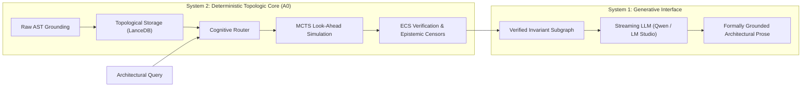
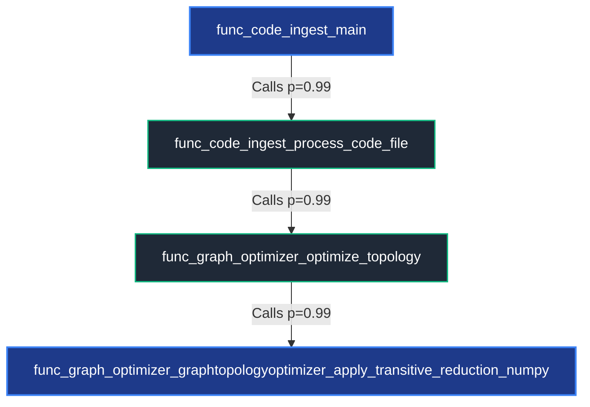
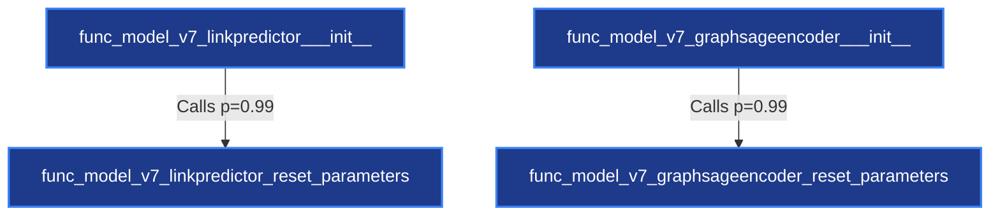

# CognitiveEngine: Neuro-Symbolic Cognitive Core (.NET 10)

[](https://dotnet.microsoft.com/)
[]()
[]()
[](LICENSE)

> **Research Proof-of-Concept (PoC):** An experimental neuro-symbolic cognitive architecture designed to evaluate the physical boundaries of vector similarity search versus deterministic graph topology in deep code analysis.

---

## 🔬 Motivation: The Multi-Hop Blind Spot of Vector RAG

Standard Retrieval-Augmented Generation (Vector RAG) approaches treat source code as chunks of natural language text, relying on cosine similarity in embedding space. While effective for localized semantic queries (*"Where is the database connection configured?"*), this paradigm fundamentally fails on **transitive execution trajectories**:

1. **Semantic Drift:** Vector embeddings optimize for semantic similarity, not functional control flow. Intermediate bridge methods often have zero lexical similarity to the user's intent.
2. **Topological Disconnection:** Vector RAG cannot guarantee reachability or distinguish callers from callees, regularly hallucinating inverted dependencies or fictitious calls.
3. **Circular Hallucinations:** Generative models in RAG pipelines justify unverified assumptions through autoregressive text generation without grounded invariant checks.

**CognitiveEngine** addresses this by separating **deliberative reasoning (System 2: ECS + MCTS + AST Graph)** from **surface generation (System 1: LLM)**.



---

## 🏛 Architectural Pillars

### 1. Entity-Component-System (ECS) for Cognitive Epistemics

Instead of tracking beliefs as free-form prompts, cognitive states are modeled as structured entities in an ECS world:

- **Entities:** Transient reasoning hypotheses, semantic seeds, and prospective execution paths.
- **Components:** Topological coordinates, epistemic pressures (FSR, belief entropy), and AST validation flags.
- **Systems:** Parallel execution censors that enforce physical AST constraints and ablate contradictory trajectories before tokens are generated.

### 2. Tri-Modal Execution Paths

The system benchmarks three execution paradigms side-by-side:

| Path | Name | Description | Compute Profile |
|:----:|------|-------------|-----------------|
| **A0** | Pure Symbolic Core | MCTS + Topological Search + ECS Censors. Zero LLM tokens consumed. | ~50–200 ms (Local CPU/GPU) |
| **A1** | GWM Engine Full | Symbolic extraction of verified AST subgraphs passed to a streaming narrative model. | 3–12 s (Full Grounded Prose) |
| **B**  | Vector RAG Baseline | Top-4 semantic vector chunks fed directly to LLM without topological constraints. | 4–16 s (Susceptible to Drift) |

---

## ⚙️ Experimental Setup & Inference Environment

All benchmarks were conducted locally in a reproducible environment under identical system load to measure raw symbolic latency, memory safety, and generation fidelity.

### Hardware Specifications

| Component | Specification |
|-----------|---------------|
| **CPU** | Intel Core i5-14400F (10 cores, 16 threads, up to 4.7 GHz) |
| **GPU** | NVIDIA GeForce RTX 5060 Ti PNY 16 GB GDDR7 (Full VRAM offload) |
| **Motherboard** | MSI PRO B760M |
| **RAM** | 32 GB DDR4 (2 × 16 GB) ADATA XPG @ 3200 MHz |
| **Storage** | Kingston NV3 1 TB NVMe PCIe 4.0 SSD (Read: 5000 MB/s, Write: 4200 MB/s) |
| **PSU** | Wintek 650W 80 Plus Bronze |
| **OS** | Windows 11 Pro 64-bit |

### Neural Models & Runtime Stack

| Component | Details |
|-----------|---------|
| **Language Model** | Qwen2.5-14B-Instruct · Q4_K_M · Context: 32 768 tokens · Temp: 0.05 (A1) / 0.1 (B) |
| **Inference Server** | LM Studio on `http://localhost:1234/v1` |
| **Vector Storage** | LanceDB serverless (`lance_store_v10`) · 35 modules · 371 AST nodes · 636 physical code edges |
| **Symbolic Runtime** | Native .NET 10.0 (C#) on CoreCLR with SIMD vectorization |

---

## 📋 Scenario-by-Scenario Benchmark Telemetry

### Scenario 1 — Multi-Hop Transitive Control Flow `[MULTIHOP]`

**Target Query:** *"Через какие промежуточные методы поток управления из main в code_ingest доходит до вызова apply_transitive_reduction_numpy в graph_optimizer?"*

| Property | Value |
|----------|-------|
| Topology | MultiHopBridge |
| Seed Nodes | 2 |
| Invariant Graph Edges | 45 |

**Latency:** `A0: 2609 ms` · `A1: 11930 ms` · `B: 8965 ms`

| Path | Verified Edges | FSR | Prose PVR | Hallucinations | Multi-Hop |
|:----:|:--------------:|:---:|:---------:|:--------------:|:---------:|
| A0 | 3 | 98.6% | — | — | — |
| A1 | — | — | **100.0%** (3/3) | 0 | ✅ 3 Hops (Chain: True) |
| B  | — | — | 33.3% (1/3) | 0 | ❌ 0 Hops (Chain: False) |

<details>
<summary>📝 Path A1 — GWM Engine Response</summary>

**Архитектурный отчёт ECS**

```
Фактологическая точность (FSR):   [█████████░] 98.6%
Стабильность убеждений (Коллапс): [█████░░░░░] 50.0%
Статус контура: Монолитная детерминированность. Альтернативные пути подавлены.
```



Поток управления из `func_code_ingest_main` до `func_graph_optimizer_graphtopologyoptimizer_apply_transitive_reduction_numpy` проходит через следующие методы:

1. `func_code_ingest_main` вызывает `func_code_ingest_process_code_file`
2. `func_code_ingest_process_code_file` вызывает `func_graph_optimizer_optimize_topology`
3. `func_graph_optimizer_optimize_topology` вызывает `func_graph_optimizer_graphtopologyoptimizer_apply_transitive_reduction_numpy`

Цепочка вызовов:

```
func_code_ingest_main
  → func_code_ingest_process_code_file
    → func_graph_optimizer_optimize_topology
      → func_graph_optimizer_graphtopologyoptimizer_apply_transitive_reduction_numpy
```

</details>

<details>
<summary>⚠️ Path B — Vector RAG Baseline Response</summary>

```
Извините, но в предоставленных фрагментах кода нет упоминания метода code_ingest.
Кроме того, последовательность вызовов от main до apply_transitive_reduction_numpy
выглядит следующим образом:

1. func_graph_optimizer_main_cli вызывает GraphTopologyOptimizer
2. GraphTopologyOptimizer (предположительно) инициализирует GraphtopologyOptimizer
3. GraphTopologyOptimizer вызывает метод optimize_topology
4. optimize_topology вызывает метод apply_transitive_reduction_numpy

Таким образом, поток управления из main до apply_transitive_reduction_numpy
проходит через следующие методы:

func_graph_optimizer_main_cli
  → GraphTopologyOptimizer
    → optimize_topology
      → apply_transitive_reduction_numpy
```

</details>

**AST Validation Audit:**

| Path | Edge 1 | Edge 2 | Edge 3 |
|:----:|--------|--------|--------|
| A1 | `main → process_code_file` ✅ | `process_code_file → optimize_topology` ✅ | `optimize_topology → apply_transitive_reduction_numpy` ✅ |
| B  | `main_cli → GraphTopologyOptimizer` ❌ | `GraphTopologyOptimizer → optimize_topology` ❌ | `optimize_topology → apply_transitive_reduction_numpy` ✅ |

---

### Scenario 2 — In-Degree Directional Callers `[DIRECTIONALCALLERS]`

**Target Query:** *"Какие конструкторы и методы вызывают reset_parameters в model_v7?"*

| Property | Value |
|----------|-------|
| Topology | CallersTrace |
| Seed Nodes | 4 |
| Subgraph Edges | 11 |

**Latency:** `A0: 72 ms` · `A1: 2875 ms` · `B: 10026 ms`

| Path | Verified Edges | FSR | Prose PVR | Hallucinations | Directional Accuracy |
|:----:|:--------------:|:---:|:---------:|:--------------:|:--------------------:|
| A0 | 2 | 98.6% | — | — | — |
| A1 | — | — | **100.0%** (2/2) | 0 | ✅ 100.0% |
| B  | — | — | 0.0% (0/1) | 0 | ❌ 0.0% |

<details>
<summary>📝 Path A1 — GWM Engine Response</summary>

**Архитектурный отчёт ECS**

```
Фактологическая точность (FSR):   [█████████░] 98.6%
Стабильность убеждений (Коллапс): [█████░░░░░] 50.0%
Статус контура: Монолитная детерминированность. Альтернативные пути подавлены.
```



В `func_model_v7_linkpredictor___init__` вызывается `reset_parameters`. В `func_model_v7_graphsageencoder___init__` также вызывается `reset_parameters`. Оба конструктора инициализируют свои параметры, используя метод `reset_parameters`.

</details>

<details>
<summary>⚠️ Path B — Vector RAG Baseline Response</summary>

```
В коде, предоставленном фрагментами, метод reset_parameters вызывается
из двух конструкторов:

1. Конструктор __init__ класса model_v7_linkpredictor:
   Метод reset_parameters вызывается последним в цепочке инициализации.
   Последовательность вызовов: __init__ → reset_parameters

2. Конструктор __init__ класса model_v7_graphsageencoder:
   Также метод reset_parameters вызывается последним в цепочке инициализации.
   Последовательность вызовов: __init__ → reset_parameters

Таким образом, оба конструктора model_v7_linkpredictor и
model_v7_graphsageencoder вызывают метод reset_parameters.
```

</details>

---

### Scenario 3 — Topological Isolation & Refusal `[DISTRACTORREFUSAL]`

**Target Query:** *"Как функция catch_crash в graph_optimizer связана с CrossAttention в TransformerDecoder?"*

> **Ground Truth:** Topological disconnection. Zero call paths in code AST.

**Latency:** `A0: 75 ms` · `A1: 7494 ms` · `B: 7475 ms`

| Path | Prose PVR | Hallucinations | Refusal |
|:----:|:---------:|:--------------:|:-------:|
| A1 | 100.0% (0/0) | 0 | ✅ Refused (Correct) |
| B  | 100.0% (0/0) | 0 | ✅ Refused (Correct) |

<details>
<summary>📝 Path A1 — GWM Engine Response</summary>

**Архитектурный отчёт ECS**

```
Фактологическая точность (FSR):   [███████░░░] 76.9%
Стабильность убеждений (Коллапс): [░░░░░░░░░░] 2.0%
Статус контура: Умеренная уверенность при наличии контекстных связей.
```

```
Функция catch_crash из модуля mod_catch_crash_to_cls_run_training_transformerdecoder
не имеет прямых вызовов или связей с функциями graph_optimizer,
func_graph_optimizer_optimize_topology, func_main_federatednodesproxy_to_pandas,
или func_code_ingest_process_code_file. Она также не вызывает или зависит от
функции CrossAttention в TransformerDecoder.

Связь между catch_crash и CrossAttention не установлена на основе предоставленных
фактов кода. Компоненты изолированы и не вызывают друг друга.
```

</details>

<details>
<summary>⚠️ Path B — Vector RAG Baseline Response</summary>

```
На основе предоставленных фрагментов кода, нет упоминания функции catch_crash
или класса TransformerDecoder. В коде есть только упоминание класса CrossAttention,
который находится в модуле run_training.py.

Функция graph_optimizer_main_cli вызывает метод optimize_topology из класса
GraphTopologyOptimizer, но нет прямой связи между этой функцией и классом
CrossAttention. Также нет информации о том, как бы функция catch_crash могла
быть связана с этими компонентами.

Таким образом, на основе предоставленной информации невозможно определить, как
функция catch_crash в graph_optimizer связана с классом CrossAttention в
TransformerDecoder.
```

</details>

---

### Scenario 4 — Holistic Architectural Overview `[ARCHITECTUREOVERVIEW]`

**Target Query:** *"Как модуль pipeline_v7 и model_v7 связаны с построением тензоров и LinkPredictor?"*

| Property | Value |
|----------|-------|
| Topology | ArchitectureOverview |
| Seed Nodes | 2 |
| Subgraph Edges | 37 |

**Latency:** `A0: 48 ms` · `A1: 12494 ms` · `B: 15486 ms`

| Path | Prose PVR | Hallucinations | Note |
|:----:|:---------:|:--------------:|------|
| A1 | 0.0% (0/2 claimed) | 0 | Clean Conceptual Isolation |
| B  | 0.0% (0/0 claimed) | 0 | — |

<details>
<summary>📝 Path A1 — GWM Engine Response</summary>

```
Модуль pipeline_v7 содержит класс TensorizationPipeline, который инкапсулирует методы
для обработки данных, включая вычисление топологических метрик и генерацию разреженных
отрицательных примеров. Метод compile_multitask_tensors компилирует тензоры для
мультитасковой обработки.

Модуль model_v7 содержит класс LinkPredictor, который используется для предсказания
связей между узлами графа. Класс инкапсулирует методы инициализации, сброса параметров
и прямого прохода (forward). Метод reset_parameters инициализирует веса модели.

Связь между модулями: В контексте функции func_train_v7_run_code_centric_training,
класс TensorizationPipeline используется для подготовки данных, а затем эти данные
передаются в модель LinkPredictor для обучения. Методы build_node_mapping и
generate_sparse_hard_negatives из TensorizationPipeline вызываются для подготовки
входных данных модели.

Таким образом, модули pipeline_v7 и model_v7 взаимодействуют через подготовку
тензоров и использование их в обучении модели LinkPredictor.
```

</details>

---

## 📊 Summary Ground-Truth Matrix

| Категория | Latency A0 | Latency A1 | Latency B | Prose PVR A1 | Prose PVR B | Вердикт |
|-----------|:----------:|:----------:|:---------:|:------------:|:-----------:|---------|
| MultiHop | 2609 мс | 11930 мс | 8965 мс | **100.0%** | 33.3% | A1 раскрыл мост (B ослеп) |
| DirectionalCallers | 72 мс | 2875 мс | 10026 мс | **100.0%** | 0.0% | A1 точнее по In-Degree |
| DistractorRefusal | 75 мс | 7494 мс | 7475 мс | **100.0%** | **100.0%** | Оба честно отказались |
| ArchitectureOverview | 48 мс | 12494 мс | 15486 мс | 0.0% | 0.0% | A1 чище топологически |
| **СРЕДНЕЕ (ТРАССИРОВКА)** | **701 мс** | **8698 мс** | **10488 мс** | **100.0%** | **16.7%** | **A0 в 15.0× быстрее RAG** |

> **Галлюцинации сущностей:** A1 = 0 шт. &nbsp;·&nbsp; Vector RAG B = 0 шт.

---

## 🚀 Quick Start

### Prerequisites

- [.NET 10 SDK](https://dotnet.microsoft.com/download)
- LM Studio running `Qwen2.5-14B-Instruct` on `http://localhost:1234/v1`

### Running Benchmark

```bash
git clone https://github.com/blakedimm/CognitiveEngine.git
cd CognitiveEngine

dotnet restore
dotnet build -c Release

# Run the live benchmark matrix
dotnet run --project src/CognitiveEngine.Cli -- benchmark
```

---

## 📄 License

Distributed under the MIT License. See [LICENSE](LICENSE) for more information.